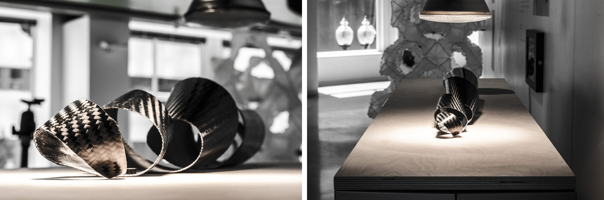

Self-Assembly Lab, MIT + Carbitex + Shopbot Project 
Team - Skylar Tibbits, Athina Papadopoulou, Sulaiman Alothman, Jaskirat Singh Randhawa, Dimitris Mairopoulos

  <iframe src="https://player.vimeo.com/video/131149780" frameborder="0" webkitallowfullscreen="" mozallowfullscreen="" allowfullscreen="">
</iframe>

This project explores large-scale Programmable Carbon Fiber produced on a 4'x2' multi-material FDM. After printing, the carbon fiber is light-activated to trigger reversible shape transformation from a flat sheet to an spiral structure. The Programmable Carbon Fiber technology has been developed in collaboration with Carbitex as an extension of their existing fully-cured flexible carbon fiber technology, CX6.

  

  
The large-format multi-material FMD was custom developed with Shopbot as a modular and easily customizable printer for large-format 2D and 3D printed structures. 

  

    Exhibited at the BSA Space, Boston MA June 2015
     
    <a href="http://selfassemblylab.net/">Self Assembly Lab,MIT</a> 
    <a href="http://carbitex.com/">Carbitex</a> 
    <a href="http://shopbottools.com/">ShopBot Tools</a> 
  

