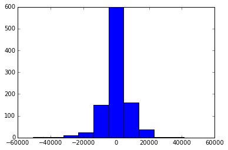

#### Task 1
Find if the review is helpful or not from a given partial Amazon Dataset

**Data**
Amazon Fine Food Reviews The Amazon Fine Food Reviews dataset consists of 455,000 food reviews Amazon users left up to October 2012.

**Description**
The data is available at the course Canvas page: Amazon.csv in “files.” The dataset is a subset of a publicly available dataset. Important: Publicly available dataset was not used in training or assessing your model. Data source reference: J. McAuley and J. Leskovec. [From amateurs to connoisseurs: modeling the evolution of user expertise through online reviews. WWW, 2013.](http://i.stanford.edu/~julian/pdfs/www13.pdf)

| Column                 | Description                                                         |
|------------------------|---------------------------------------------------------------------|
| Id                     | -                                                                   |
| ProductId              | unique identifier for the product                                   |
| UserId                 | unique identifier for the user                                      |
| ProfileName            | -                                                                   |
| HelpfulnessNumerator   | number of users who found the review helpful                        |
| HelpfulnessDenominator | number of users who indicated whether they found the review helpful |
| Score                  | rating between 1 and 5                                              |
| Time                   | timestamp for the review                                            |
| Summary                | brief summary of the review                                         |
| Text                   | text of the review                                                  |
| helpScore              | HelpfulnessNumerator / HelpfulnessDenominator                       |
| helpful                | boolean; =True if review is “helpful”                               |

**Classification Task**
You are going to train a model to best predict helpful, a boolean indicator that a review was deemed helpful by other shoppers. This was defined as:
*(data.HelpfulnessDenominator > 3) & (data.helpScore >= 0.9)*

**Restrictions**
Following variables in Amazon.csv (or variations of them) as features were used:
- helpful
- helpScore
- HelpfulnessNumerator
- HelpfulnessDenominator

#### Results:

#### Logistic Regression
- Error rate on training set: 0.0621569858713  
- Accuracy rate on training set: 0.937843014129
- True positive rate on training set: 0.150551059067
- Error rate on test set: 0.0675677655678
- Accuracy rate on test set: 0.932432234432
- True positive rate on test set: 0.0894373938243
- True negative rate on test set: 0.999122481086

#### SVM
- Error rate on training set: 0.000963893249608
- Accuracy rate on training set: 0.99903610675
- True positive rate on training set: 0.993671431032
- Error rate on test set: 0.121164835165
- Accuracy rate on test set: 0.878835164835
- True positive rate on test set: 0.422903967223
- True negative rate on test set: 0.914904382061

#### Naive Bayes
- Error rate on training set: 0.00352904238619
- Accuracy rate on training set: 0.996470957614
- True positive rate on training set: 0.993972791459
- Error rate on test set: 0.0932747252747
- Accuracy rate on test set: 0.906725274725
- True positive rate on test set: 0.352853002898
- True negative rate on test set: 0.950542717779

#### Perceptron
- Error rate on training set: 0.000913657770801
- Accuracy rate on training set: 0.999086342229
- True positive rate on training set: 0.993456173584
- Error rate on test set: 0.120886446886
- Accuracy rate on test set: 0.879113553114
- True positive rate on test set: 0.422804037174
- True negative rate on test set: 0.915212699517

* * *
* * *

#### Task 2
Predicting Salaries from a limited dataset of salaries of 2,309 employees.

**Data** : Salaries The salaries.csv dataset consists of 2,309 salaries in the U.S. and Canada of members of an unnamed professional organization.

| Column                 | Description                                                              |
|------------------------|--------------------------------------------------------------------------|
| Function               | Job title, masked                                                        |
| sup1 - sup5            | Number of employees supervised, for each type of employee (masked)       |
| salary                 | Salary in U.S. dollars                                                   |
| gender                 | gender                                                                   |
| disabled               | = TRUE if disabled                                                       |
| race                   | race                                                                     |
| yearsInPosition        | Number of years in current position                                      |
| yearsInProfession      | Number of years in the profession                                        |
| age                    | age                                                                      |
| cred1 - cred2          | =TRUE of credential obtained (credentials masked)                        |
| highestDegree          | Highest degree earned                                                    |
| inst1 - inst5          | Number of employees in department at institution, for each type (masked) |
| instBudget             | Budget of department, in U.S. dollars                                    |
| Country                | Country (U.S. or Canada)                                                 |
| City                   | City                                                                     |
| State                  | State                                                                    |
| Zip                    | Zip code                                                                 |
| Category               | Category (masked)                                                        |
| instSize               | Size of institution                                                      |
| instType               | Type of institution (public or private)                                  |

**The data is available at:**
[https://github.com/visualizedata/ml](https://github.com/visualizedata/ml)
Provided by Aaron Hill.

**Regression Task** Train a model to best predict salary

**Data Augmentation** The data was augmented with other sources (on City, State, and/or Zip Code only). The features were added before training the model, including dealing with missing values.

**Sources**
- [State Tax Collections](https://goo.gl/rCNLwi)
- [Geo Data](http://download.geonames.org/export/dump/)
- [Subsidized Households 2008](http://www.HUDuser.org/portal/picture2008/2008_tract.zip)
- [Zip Codes](https://www.aggdata.com/node/86)
- [Unemployment Rates](http://www.bls.gov/lau/laucntycur14.txt)

[Original Dataset](https://github.com/jaskiratr/Machine-Learning/blob/master/Assignment%202/salaries_original.csv)

[Final Parent Dataset](https://github.com/jaskiratr/Machine-Learning/blob/master/Assignment%202/salaries_parent.csv)

#### Results :
#### Linear Regression
- Intercept: 50987.7822484
- Residual sum of squares, training data: 57319450.73
- Residual sum of squares, test data: 81629776.52
- Variance score, training data: 0.83

Distribution of prediction error on training data:

Distribution of prediction error on test data:

#### Polynomial Regression
- Intercept: 23481.0611532
- Residual sum of squares, training data: 0.00
- Residual sum of squares, test data: 503583211.41
- Variance score, training data: 1.00

Distribution of prediction error on training data:

Distribution of prediction error on test data:

#### Ridge Regression
- Intercept: 17798.1238858
- Residual sum of squares, training data: 58311575.32
- Residual sum of squares, test data: 80243320.76
- Variance score, training data: 0.83

Distribution of prediction error on training data:

Distribution of prediction error on test data:

#### Residual Sum of Squares on test datasets :

* * *
* * *

#### Task 3

**Dataset** Same as Task 1

**Clustering Task** Use KMeans to create an Amazon product recommendation system based on user reviews. The system clusters the products based on patterns created by users who write multiple reviews. One limitation of the data is the lack of a feature that names the product (ProductId is included, but there is no product name). However, in most cases, the product can be deduced by reading the review summary and the first few lines of the review.

The dataset was not augmented with the data with other sources . However, the original dataset required extensive transformations and feature extractions before training the model.

[Github Repo](https://github.com/jaskiratr/Machine-Learning)
