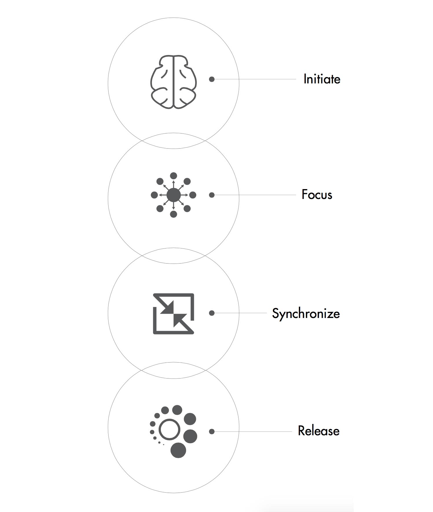

 

  <iframe src="https://player.vimeo.com/video/114450990" frameborder="0" webkitallowfullscreen="" mozallowfullscreen="" allowfullscreen=""></iframe>

  

  

  

  

    Nkisi means spirit. The idea behind this project was to explore user experiences while learning from the past. Technkisi was inspired by the 19th century rituals performed around the figurines from Central West Africa. Some of the original figurines are in the collection of Department of the Arts of Africa, Oceania, and the Americas at The Metropolitan Museum of Art.
    

  
The user communicates with the sculpture with his/her own mindwaves via a wireless BCI (Brain Computer Interface). The sculpture listens, interprets and absorbs the concerns of the user. It changes its physical form to respond to the user's state of mind. It then inherits the user's negativity and cries out machine oil, relieving the user of the burden.
    The goal was to develop an immersive and interactive experience to realize technology as a conscious entity.
    

  

  

    The kinetic sculpture was designed by 3D scanning the original artifact and was modified into a low polygon model.
The model was split into 14 layers each of which can individually move in its own plane. Each layer was 3D printed and the spine was customized out of acrylic to hold the layers in place.
The steering mechanism runs through the spine of the sculpture. The whole assembly sits in a basin of oil.

  
Process -
When the ritual is initialized, the sculpture begins to move. The user sitting infront of the sculpture silently focuses on his/her thoughts.The user mentally addresses a concern to the sculpture. After enough focus is established. The sculpture lights up and form a cohesive shape of human face indicating that the user is in sync with the it and has its undivided attention. The user then meditates to release their concern for the sculpture to inherit it.After a while the sculpture would cry out oil as a representation of it empathizing with the user.

  

  

Special thanks to :- 
Don Undeen - Senior Manager, MET MediaLab 
Yaëlle Biro - Associate Curator for Arts of Africa 
Sabine Seymour - Assistant Professor, The New School
