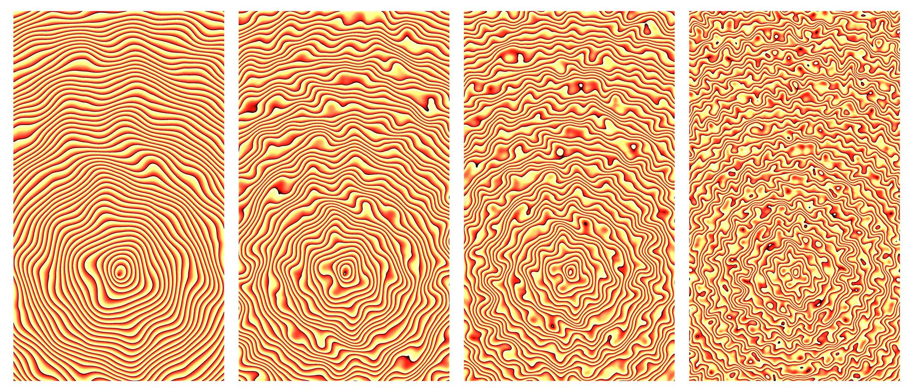

The graphics were created using the Graphics Shader Library GLSL. It was a mathematical exploration visuallized using code for graphics without the use of post-processing.

GLSL is a relatively low-level computer language, hence all the code needs to be written from scratch to define functions like _random_ and _noise_. The final generated image is an amalgamation of multiple mathematical equations that essentially manipulate the color of the pixels.

Gradients can be generated by shaping functions. My artistic goal was to create realistic animations to mimic the interplay of light and shadow. GLSL is the basis of anywhere advanced graphics are used in computer applications. Unlike other advanced parametric tools with sophisticated GUI like that of Grasshopper and Houdini, GLSL runs on a single file of written code. The images shown are two-dimensional stand-alone pieces of work which can vary from simple geometries to highly complex patterns. Technically, these are known as fragment shaders.

Shaders helped me fundamentally understand the space time relationships in form of colors. By comprehending shaping functions in a 2D geometry, they can be applied to transform shapes in 3D space. Those shaders are typically refered to as vertex shaders.

Check out the repository here on [Github](https://github.com/jaskiratr/randj063_ss2015)
