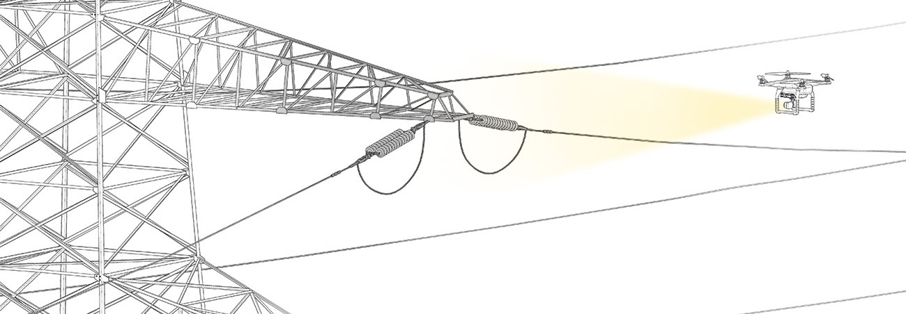

Project Team:
Jaskirat Randhawa, Grace Jun, Charles Saidel

Terra is a terrain mapping service that uses drones to 3D scan for constructing and inspecting power lines.
Using PowerGrid India as an exemplary client, we are focusing to provide a service for engineers working on the construction & maintenance of transmission power lines.

<iframe src='https://player.vimeo.com/video/150319900' frameborder='0' webkitAllowFullScreen mozallowfullscreen allowFullScreen></iframe>

My responsibilities included data procurement from Power Grid Corporation of India Ltd. I coordinated with the managers in the Asset Management department to formulate the viability of Terra.
The team members cooperatively carried out photogrammetry tests and I worked with various software to obtain the best results.

	Currently, 125 miles a day for line data can be collected by using helicopters. The cost of that is 300.00 USD per mile. Hence the daily cost of using helicopters is estimated 37, 500 USD.

For a fraction of that cost, drones can be deployed in certain scenarios for local inspection within 5mile radius per flight. It can greatly assist in providing accurate latest data in support of remote sensing technologies.

Drones can inspect : 
- Sag detection in conductors 
- Conductor and ground clearances 
- Visual defects in assets.

	The images on the left show the flight Path of the drone for scanned test area. The point cloud reconstruction was done using the Pix4D mapper Software.
  Terra can be used for two scenarios: 
  - To scan a terrain prior to construction of power transmission lines.  
  - To inspect the existing power transmission lines for fault and defects.

Sample Results: Digital Surface model created by the Pix4D software.
