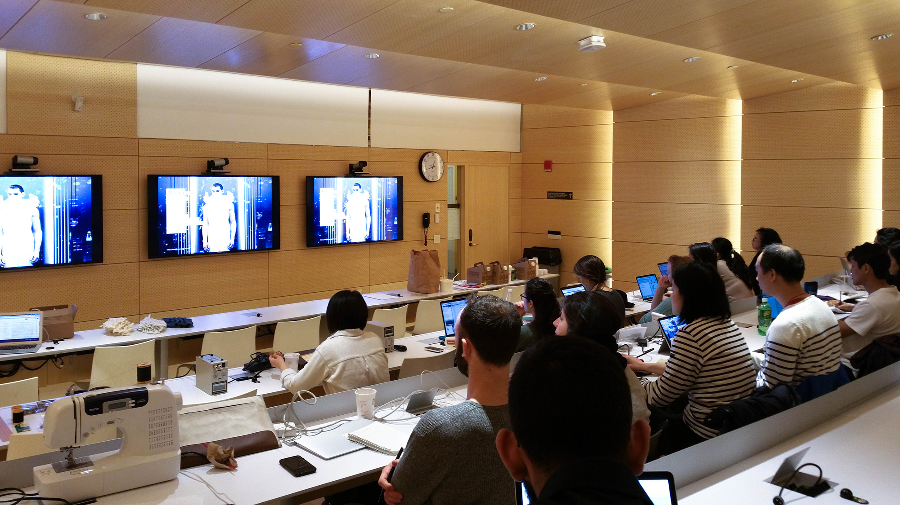
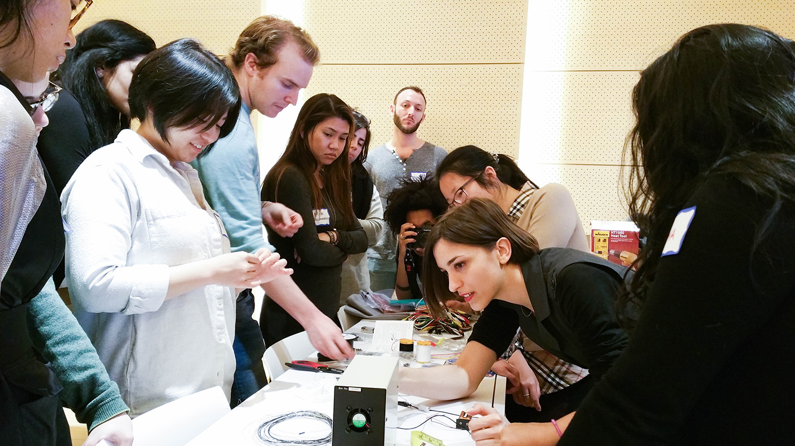
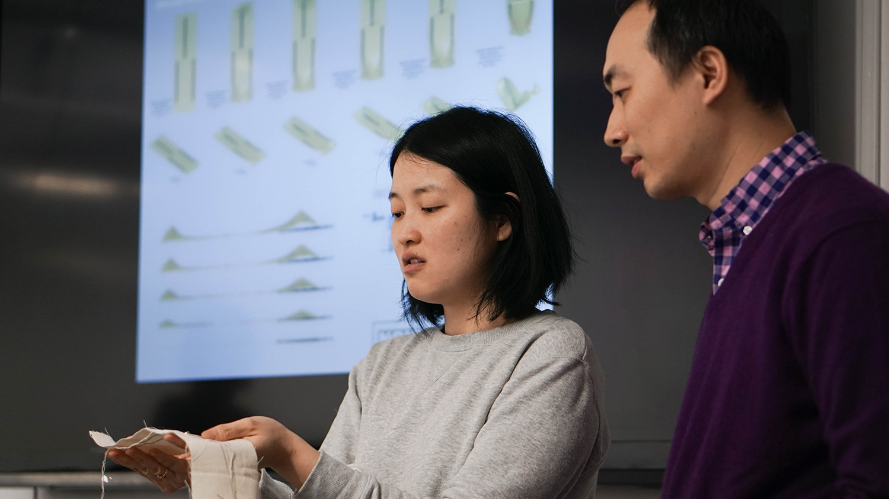

#### Noumena X Wearshops

The “Shape Changing Materials” workshop brought together smart materials with computational design and digital fabrication in context to garments or wearables.
This 3-day workshop explored the possibilities of interactive wearable projects and finding alternative ways to use smart materials. The participants experimented with responsive shape-shifting materials through 3D modeling and computation-based approaches using Rhinoceros and Grasshopper.

Along with hands-on prototyping, starter-code was provided for participants and workshop guests to generate a digitally simulated materials. The final outcome was be prototypes of shape changing materials to discover garment behavior. Participants used user-centered methods to contextualize the use cases of an interactive garment solution.

  <iframe src="https://player.vimeo.com/video/163944717" frameborder="0" webkitallowfullscreen="" mozallowfullscreen="" allowfullscreen=""></iframe>

<h4>INSTRUCTORS</h4>
 
<ul>
<li>Efilena Baseta</li>
<li>Grace Jun</li>
<li>Jaskirat Randhawa</li>
</ul>

<h4>PARTICIPANTS</h4>
 
<ul>
<li> Attie Chan</li>
<li> Autumn Kietponglert</li>
<li> Boris Yu</li>
<li> Fulya Turkmenoglu</li>
<li> Harmony Pilobello</li>
<li> Ivor Ip</li>
<li> Jordan Frand</li>
<li> Mia Baldonado</li>
<li> Pablo Criado-Pérez</li>
<li> Ran Tian</li>
<li> Renata Gaui</li>
<li> Savani Mirashi</li>
<li> Suma Balaram</li>
<li> Savani Mirashi</li>
<li> Terricka Johnson</li>
<li> Xiang Liu</li>
</ul>

<h4> LINKS</h4>
<ul>
<li>[PDF Paper](https://www.researchgate.net/publication/301693041_Shape_Changing_Materials_Exploring_Applications_of_Smart_Memory_Alloy_with_Fabric_and_3D_Visualizations)</li>
<li>[Noumena](http://noumena.io/?page_id=12431)</li>
<li>[Wearshops](http://wearshops.com)</li>
</ul>

